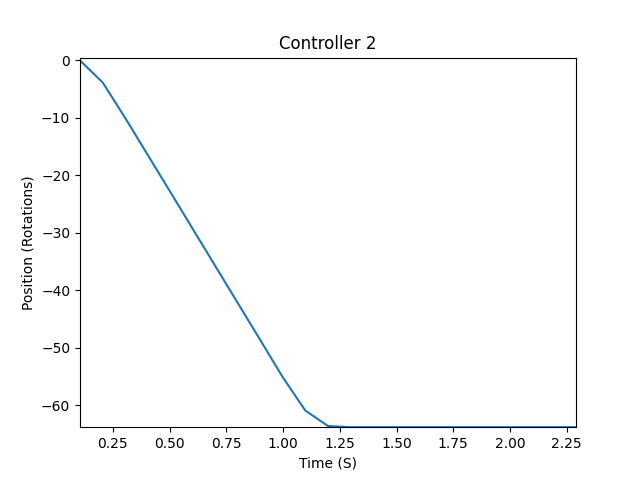
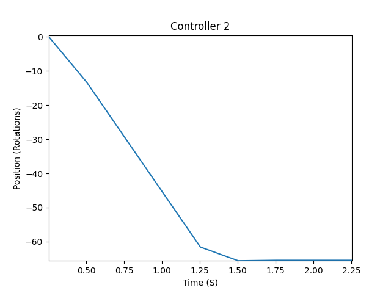

# ME-405-lab3
## ME 405 Lab 3: On Schedule

### Brief Summary
This README is for the ME-405-lab3 repository. This project attempts to integrate our previous motor controller system into a cooperative multi-tasking system. This was done through integrating our working motor controller code with the shares and cotask system developed by the ME405 department (Dr. Ridgley{aka Spluttflob}). What this achieved is making a control system capable of operating several motors and encoders.

---

### Operation

1. Activate the Microcontroller **Main** program by using a connected debugging computer connected by the Shoe link
2. Activate the **Motor Decoder** program on the seperate computer connected by the ST-Link
3. Input Parameters for both motors
4. Let program run as long as you wish
5. **Use Keyboard interrupt on the debugging computer in order to stop the program**
6. After the program is stopped, the decoder will wait for its 3 second time out before it plots the data it accumulated
7. The plot for each motor is displayed after the plot for the previous motor is saved. Be sure to save the plot then close to open the next plot

---
## Program Specifications
Refer to *ME-405-lab-2* repository and [README](https://github.com/rmevorac/ME-405-lab2/blob/main/README.md) for a detailed explanation on the motor controller and its components such as the motor driver and motor encoder.

---

# Detailed Information
This section contains detailed information on specific programs and aspects of the system.

---

## Characteristics of various Task Peroids and finding the optimal Peroid.
For our multi-task controller we want to determine the slowest period where the motor controller no long provides a reliable step response. We tested a variety of task peroids on two motors in tandem to showcase the decay in quality and resolution:

### Datum Frequency: 10 ms
               Motor 1     |  Motor 2
:-------------------------:|:-------------------------:
  |  
       

---

### 25 ms
        

---

### 50 ms
        

---

### 75 ms
        

---

### 100 ms
        

---

### 250 ms
        

---

### 500 ms
        
